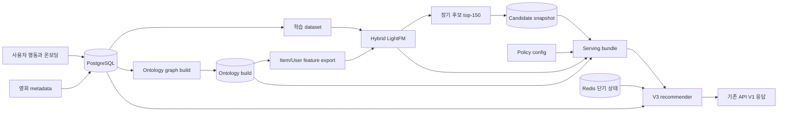
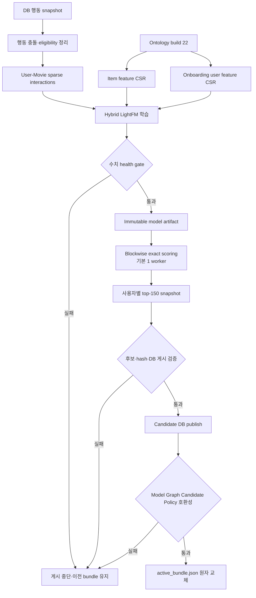
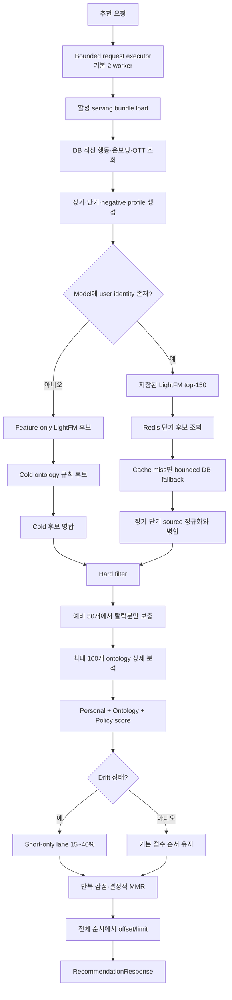
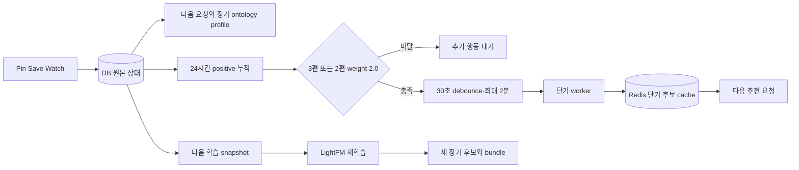
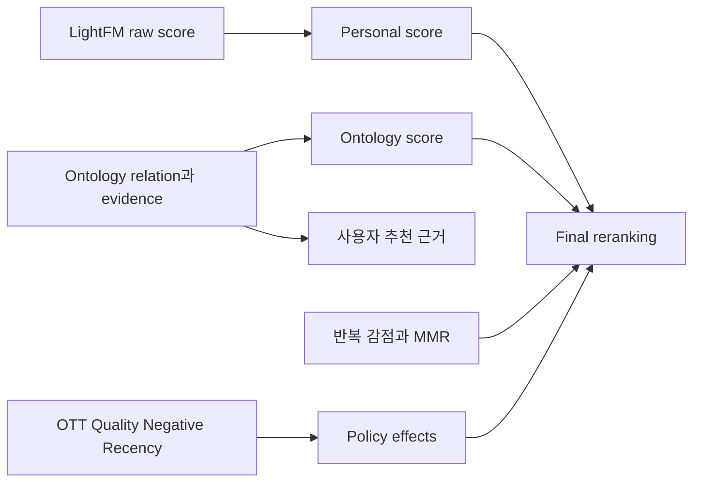

# 01. V3 아키텍처와 파이프라인

## 목적

이 문서는 과거 구현 계획이 아니라 V3 S0~S9에서 실제로 완성한 구조를 기록한다. 다음 작업은 [08 후속 작업](08_additional_work_backlog.md)에서만 관리한다.

## 계층 구조

역할은 다음과 같이 분리한다.

- LightFM: 장기 개인화 후보와 협업 신호
- Ontology: item/user feature, 단기·cold 후보, 의미 근거
- Policy engine: hard filter, OTT, negative, catalog 품질, 반복 감점, 최종 재정렬
- Serving bundle: model, ontology, candidate, feature registry, policy의 호환 가능한 원자적 활성화



API 경로의 `v1`은 HTTP API 버전이며 추천 엔진 V1을 뜻하지 않는다. `RECOMMENDATION_ENGINE`이 V1/V2/V3 engine adapter를 선택한다.

## 학습·사전 계산 파이프라인

장기 후보를 준비하는 흐름이다. 현재는 수동 실행 진입점이 있고 전체 과정을 정기 실행하는 production scheduler는 후속 작업이다.



핵심 경계:

- 전체 사용자 x 전체 영화 dense score matrix를 만들지 않는다.
- user/item block만 계산하고 사용자별 bounded top-K를 유지한다.
- user block 동적 큐는 지원하지만 1·2·4 worker 비교에서 이득이 없어 기본값은 1이다.
- 일부 사용자 실패는 격리하며 이전 정상 후보를 보존한다.
- model, graph, candidate, policy 중 하나만 단독 활성화하지 않는다.

## 추천 요청 파이프라인



추천 계산은 API event loop에서 직접 실행하지 않는다. 공용 thread executor가 최대 2건을 동시에 처리하고 대기 요청은 bounded worker 수 뒤에서 순서대로 실행된다. 각 작업은 자기 `SessionLocal`을 열며 model artifact만 메모리에서 공유한다.

## 후보 수 흐름

```text
LightFM 저장 후보                    150개
  = 기본 순위                        100개
  + hard filter 보충용 예비           50개

장기 후보 + 단기 후보 + cold 후보
  -> source 정규화·병합
  -> hard filter
  -> 탈락한 수만큼만 예비 후보 검사
  -> 상세 분석·최종 policy 입력       최대 100개
  -> API page                         보통 20개
```

예비 50개는 추천 결과를 150개로 늘리는 용도가 아니다. 앞 100개에서 DB 미존재, watched, passed, OTT, 상태 조건으로 탈락한 자리만 채우고 남은 예비 후보는 버린다.

## 행동 갱신 흐름



같은 행동은 다음 요청의 장기 ontology profile과 단기 profile에 모두 들어간다. 단기 worker는 최근 후보만 갱신하며 LightFM을 학습하지 않는다. LightFM 기반 장기 후보는 재학습·candidate 재생성·bundle 활성화 후 바뀐다.

Passed와 OTT 변경은 단기 후보를 재생성하지 않는다. 최신 hard filter와 serving context가 다음 요청에서 즉시 적용된다.

## 점수와 설명 분리



Ontology 근거는 후보와 사용자 사이의 의미 관계를 설명한다. LightFM이 그 관계 때문에 점수를 냈다는 인과 설명으로 사용하지 않는다.

## S0~S9 결과

| 단계 | 상태 | 구현 결과 |
| --- | --- | --- |
| S0 | 완료 | API 버전과 추천 엔진 버전을 분리하고 `RECOMMENDATION_ENGINE=v3` adapter를 연결했다. V1/V2는 유지한다. |
| S1 | 완료 | saved, pinned, watched, passed, favorite 현재 상태를 one-row-per-user-movie snapshot으로 만들고 passed 우선 충돌 규칙을 적용했다. 소셜 신호는 진단 전용이다. |
| S2 | 완료 | ontology schema `0.2.0`, build `22`, item feature CSR, bounded user feature 계약을 구축했다. |
| S3 | 완료 | identity-only LightFM을 dependency·artifact reload 기준선으로 구현했다. 운영 선택 모델은 hybrid다. |
| S4 | 완료 | DB 행동 기반 장기·단기 profile, negative profile, 최근 30일 최대 50개, drift 근거를 분리했다. |
| S5 | 완료 | ontology item/user feature를 결합한 hybrid LightFM과 immutable artifact, 수치 health gate를 구현했다. |
| S6 | 완료 | dense 전체 점수 행렬 없이 blockwise exact top-150을 만들고 checkpoint, 사용자 실패 격리, 원자 게시를 지원한다. |
| S7 | 완료 | LightFM과 독립적인 단기 ontology 후보, source 정규화, bounded graph analyzer와 Redis cache/DB fallback을 구현했다. |
| S8 | 완료 | known/cold 경로, hard filter, 점수 trace, drift lane, quality/negative/repetition/MMR 정책을 구현했다. |
| S9 | 완료 | immutable serving bundle 검증·활성화, model memory cache, invalid reload 시 이전 bundle 유지, 기존 응답 계약 연결을 구현했다. |

## 현재 artifact

| 항목 | 값 |
| --- | --- |
| ontology | build `22`, node `3,756,594`, edge `12,640,874`, evidence `2,078,395` |
| item feature | `1,176,540 x 1,502,427`, `nnz=10,505,033` |
| model | `hybrid-02e666e23f10-d8dd44e869db-e2a5a2a2e0ca-45932f2c79ee-9e3651b419af-7b869d3b` |
| candidates | `cand-dd6dd505d38733bfb53d2aa8`, 128명 x 150개 |
| policy | `v3-policy-quality-v1` |
| bundle | `bundle-ff3d35e49ba03cc72adc9eed` |

전체 graph build `22`는 498.3초, full item feature export는 77.8초가 걸렸다. 모델 학습과 candidate materialization의 최신 품질 결과는 [10 품질 개선 기록](10_quality_improvement_record.md)을 따른다.

## 보존할 불변식

- API V1 경로와 `RecommendationResponse`를 유지한다.
- V3가 준비되지 않으면 엔진 내부에서 V1로 조용히 위장하지 않는다.
- 온라인에서 전체 graph scan이나 후보별 graph query를 하지 않는다.
- user-by-all-movies dense matrix를 만들지 않는다.
- OTT는 LightFM feature가 아니라 serving filter/context다.
- short-term 후보는 LightFM 후보와 독립적으로 생성할 수 있어야 한다.
- DB 행동 timestamp가 단기 취향의 원본이며 Redis는 파생 cache와 작업 상태다.
- LightFM 점수, ontology 점수·근거, 정책 효과, 최종 점수 trace를 분리한다.
- model, ontology, candidate, policy는 검증된 bundle 단위로만 활성화한다.

## 완료 범위 밖

S0~S9 완료는 서비스의 모든 운영 기능과 추천 품질이 끝났다는 뜻이 아니다. 정기 재학습 scheduler, metadata 자동 갱신, 피드 세션, durable 행동 전달, 실사용자 학습, 소셜 학습, 상세 evidence path와 트래픽 최적화는 [08 후속 작업](08_additional_work_backlog.md)에 남아 있다.
